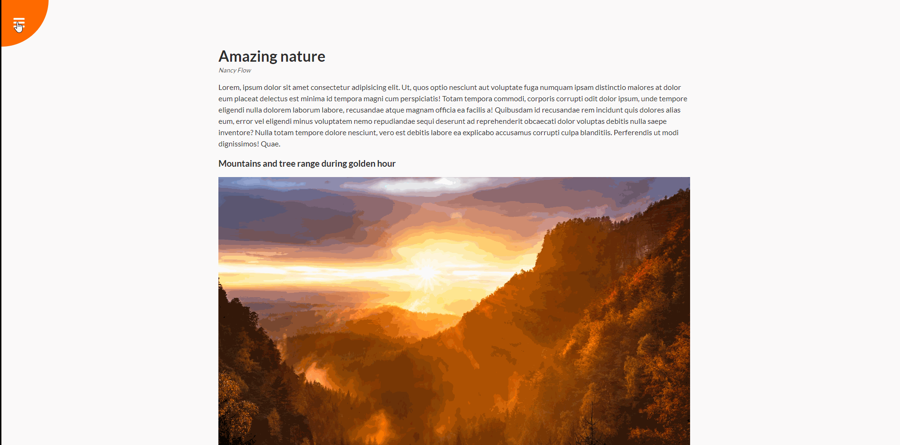

# Rotating Navigation

## 🦉 Main information

An article (one page, blog or whatever) with rotating navigation bar effect.

The project goal:
- when the user clicks on the navigation icon, the entire website page must be rotated
- navigation icons should change to open-close 
- navigation items should be at the bottom of the page
- set up in HTML, style it with CSS and add the functionality with JavaScript

## ⚡ Built With

[HTML5](https://www.w3schools.com/html/) / [CSS3](https://www.w3schools.com/css/) / [JavaScript](https://www.w3schools.com/js/)